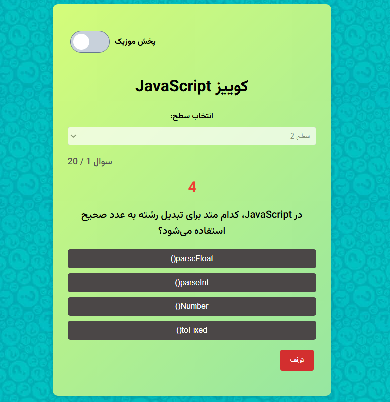

# پروژه جاوااسکریپت خام من

این پروژه یک مثال ساده از کاربرد js است.  
ویژگی‌های اصلی پروژه شامل پخش موزیک در پس زمینه و در هنگام پاسخ و غیره می‌باشد.

---

## 🎯 ویژگی‌ها

- تاگل دکمه با تغییر تصویر PNG  
- پخش موزیک پس‌زمینه با قابلیت تکرار و کنترل صدا  
- استفاده از CSS ساده و گرادینت‌های زیبا  
- ریسپانسیو برای موبایل و دسکتاپ  

---

## ⚙️ پیش‌نیازها

- مرورگر مدرن (Chrome, Firefox, Edge)  
- اختیاری: Live Server برای تست محلی  

---
## ⚙️ تکنولوژی ها

HTML5

CSS3

JavaScript (Vanilla)

---


## 🚀 نحوه اجرا

1. مخزن را کلون کنید یا فایل‌ها را دانلود کنید:
   ```bash
   git clone https://github.com/shahink99/Quiz-app .git


## ⚙️ اسکرین شات پروژه
